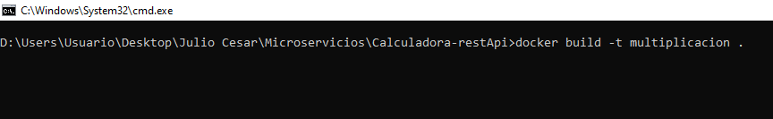

Integrantes: 

Julio Cesar Reina   20201099045

Cristian Gonzales   20201099032

Andres Lozano       20201099038

# Microservicios

## 1. DEFINICIONES
### ¿Que es un Microservicio?

Según James Lewis y Martin Fowler (los creadores del concepto) los microservicios son un enfoque para desarrollar una única aplicación como un conjunto de pequeños servicios, cada uno ejecutándose en su propio proceso y comunicándose con mecanismos ligeros, a menudo una API a través de HTTP.

Estos servicios se desarrollan alrededor de capacidades de negocio y se pueden implementar de forma independiente y completamente automatizada. Existe un mínimo de administración centralizada de estos servicios, que puede escribirse en diferentes lenguajes de programación y utilizando diferentes tecnologías de almacenamiento de datos.

Los microservicios se adaptan perfectamente a los requerimientos de agilidad, escalabilidad y confiabilidad de las aplicaciones modernas en la nube.

### FLASK

Flask es auto denominado como un microframework de python para crear aplicaciones web, es decir, páginas web dinamicas, APIs, etc. Una de las principales características de Flask es que se pueden crear aplicaciones web rápidamente y con un mínimo número de líneas de código.

### DOCKER (Configuration Service)

Docker es una plataforma de software que le permite crear, probar e implementar aplicaciones rápidamente. Docker empaqueta software en unidades estandarizadas llamadas contenedores que incluyen todo lo necesario para que el software se ejecute, incluidas bibliotecas, herramientas de sistema, código y tiempo de ejecución. Con Docker, puede implementar y ajustar la escala de aplicaciones rápidamente en cualquier entorno con la certeza de saber que su código se ejecutará.

-	Comando Run (Opciones) (-d, -p)

### KONG

### POSTMAN

Es una herramienta que nos permite crear peticiones sobre APIs de una forma muy sencilla y poder, de esta manera, probar las APIs. Todo basado en una extensión de Google Chrome. El usuario de Postman puede ser un desarrollador que esté comprobando el funcionamiento de una API para desarrollar sobre ella o un operador el cual esté realizando tareas de mnonitorización sobre un API.

### API GATEWAY

Un API Gateway proporciona un punto central de acceso a todos los clientes para gestionar, supervisar y asegurar el acceso a los servicios backend expuestos, que ofrecen nuestros productos digitales.

## 	2. INSTALACION

###	KONG
Para Instalar Kong con Docker primero se deben establecer una base de datos, puede ser cassandra  o postgres, el siguiente comando permite realizar su creación: 

- **docker run -d --name kong-database -p 5432:5432 -e "POSTGRES_USER=kong" -e "POSTGRES_DB=kong" postgres:9.5**

Una vez creada, podemos ejecutar el comando para instalar Kong:

- **docker run -d --name kong --link kong-database:kong-database -e KONG_DATABASE=postgres -e KONG_PG_HOST=kong-database -p 8000:8000 -p 8443:8443 -p 8001:8001 -p 7946:7946 -p 7946:7946/udp kong:0.10.1**

Si todo a salido bien, en el dashboard de Docker se podrán visualizar los dos contenedores

Figura 1.  Contenedores para Kong y su base de datos en Docker

###	API CON FLASK
Para crear los microservicios con Flask, primero se debe tener instalado python y basta con hacer una importación para poderlo usarlo. A continuación, se pude visualizar un servicio en Flask en donde se importa flask y jsonify, request para manejar respuestas en formato json para el servicio.
Cada marco web comienza con el concepto de servir contenido en una URL determinada, así pues, se incluye la notación @app. route, en donde se define una ruta y el tipo de método para acceder a esta como POST o GET. Enseguida se define una función y se procede la realizar la respectiva lógica del servicio.
En este archivo, también se define el host y el puerto a través del cual el servicio estará expuesto, para el caso es localhost y el puerto 100

Figura 2. Archivo Multiplicacion.py

Es importante resaltar que se debe tener un archivo para cada uno de los servicios que se quiere exponer, en donde solo varia el nombre de la ruta, la lógica del servicio y el puerto en donde se quiere desplegar, como se puede visualizar en la siguiente imagen:

Figura 3. Archivo Resta.py

Una vez que ya se tienen los servicios a desplegar se procede a crear un archivo llamado Dockerfile, un archivo de texto plano que contiene las instrucciones necesarias para automatizar la creación de una imagen que será utilizada posteriormente para la ejecución de instancias específicas.
Así pues, en este archivo se define principalmente un sistema operativo Linux, para el caso es Alpine en su versión 3.10, enseguida se ejecuta el administrador de paquetes apk para agregar o instalar Python y de igual forma pip. Para se mas automático el proceso, se crea una carpeta o directorio llamada app, en ella se copia todos los archivos utilizados. 

Figura 4. Archivo Dockerfile

También es necesario instalar los componentes necesarios para correr la aplicación, para el caso Flask, es por esto que se debe crear un archivo llamado requeriments.txt y ejecutarlo. Una vez que todo esta instalo se procede a correr la aplicación con el comando CMD.

Figura 5. Archivo requeriments.txt

Una vez, ya se tiene todo configurado, se procede a generar la imagen en Docker a través del siguiente comando:

Figura 6. Comando generación de imagen en Docker

Este comando creara una nueva imagen y realizara todos los pasos o sentencia definidos en el archivo Dockerfile. Enseguida se debe ejecutar la imagen creada, esto a través del comando:

Figura 7. Comando ejecución imagen en Docker

Se debe resaltar que en este comando se define el nombre de la imagen, y además con que puerto se quiere relacionar, es decir, en el contenedor la aplicación se expondrá en el puerto 100, pero en nuestra maquina local no tenemos acceso a este, por lo cual se debe relacionar. Para el caso se relaciona el puerto 100 con el puerto 100. 
Si todo se ejecuta correctamente tendremos un nuevo contenedor y podremos probar el servicio publicado, para el caso se puede utilizar el software Postman:

Figura 8. Contenedor en Docker para el servicio de multiplicación.

Figura 9. Servicio que cumple la función de multiplicar.

Así pues, ya se tiene el servicio de multiplicar expuesto y funcionando. Para crear los servicios de las demás operaciones matemáticas se debe hacer el mismo procedimiento con los demás archivos, configurando en el archivo Dockerfile, la aplicación que se quiere iniciar, y teniendo en cuenta los puertos de exposición. 

Para el caso se creó el contenedor división expuesto en el puerto 70, multiplicación en el puerto 100, resta en el puerto 90 y por ultimo la suma en el puerto 80.

Figura 10. Contenedores creados en Docker.

###	CONFIGURACION KONG
Para la configuración de Kong se utilizó el software KongDash, esto con el fin de hacerlo más gráfico y visual. En este software se procede a configurar cada una de las Apis a gestionar. Así pues, para teniendo en cuenta el api de multiplicación se define un nombre, el host donde se expondrá y la URI y Upstream URL a donde se redireccionará las peticiones, como se puede ver en la imagen.

Figura 11. Creación de api en Kong.

Una vez configurado se procede a probar el servicio desde el Gateway, para el caso el host es localhost, el puerto 8000 y la URI definida

Figura 12. Prueba servicio multiplicación desde el Gateway

Teniendo una prueba satisfactoria, se procede a crear las Apis para los demás servicios en Kong
 

Figura 13. Apis creadas en Kong

Para finalizar se podrá ver todos los contenedores en Docker funcionado correctamente

 
Figura 14. Contenedores creados en Docker

Conclusiones

- En su mayoria las aplicaciones basadas en microservicios deberían consumirse mediante una API Gateway, para que interactúe como un único punto de entrada en el conjunto de microservicios, enrutando las solicitudes y la traducción de protocolos.

Referencias Web

- https://blog.mdcloud.es/que-son-los-microservicios-definicion-caracteristicas-y-retos/

- https://aws.amazon.com/es/docker/

- http://www.arquitectoit.com/postman/que-es-postman/

- https://medium.com/@jovaniarzate/apis-y-microservicios-en-empresas-monol%C3%ADticas-api-gateway-y-management-6-69ba6dd0080c
